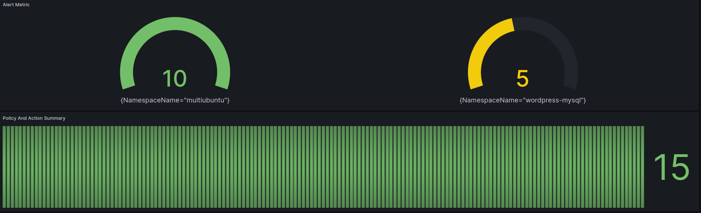
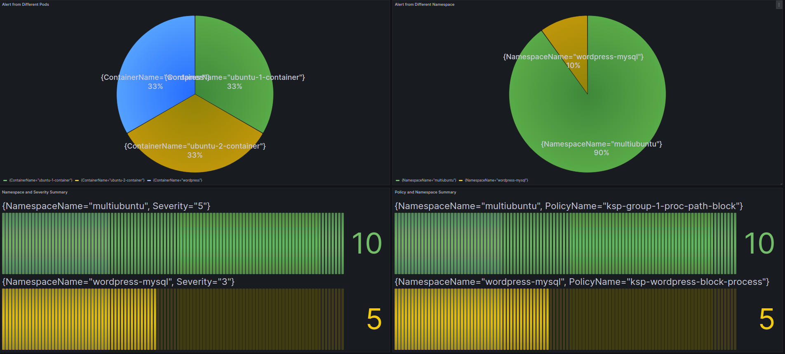
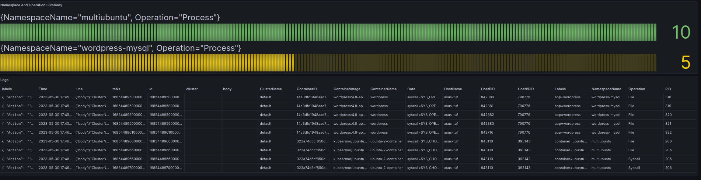

## Loki Graphana Alert DashBoards
Follow [Grafana tutorial](../logs/tutorial_grafana.md) to deploy loki grafana 

Users can gain several insights on alerts logs with the help of Loki and Graphana on 
- Alert Metric
- Alert from Different Pods
- Alert from Different Namespace 
- Alert based on Operations
- Policy and Action Summary 
- NameSpace Matched Policy Count
- Namespace Severity Summary
- Alert Based on Tags


To View the DashBoards

* Open up a browser and go to [localhost:3000](localhost:3000)
* Go to sidebar and open ``Dashboards`` -> ``New`` -> ``Import``

Drag and drop the file from ```res/alert-dash-exp.json```

* Go to ``Dashboard`` section , select ``KubeArmor-Alerts Dashboards``

* The visalisations should be ready !!

Here are some example visulisation with [multiubuntu](https://github.com/kubearmor/KubeArmor/blob/main/examples/multiubuntu.md) and [wordpress-mysql](https://github.com/kubearmor/KubeArmor/blob/main/examples/wordpress-mysql.md) example



