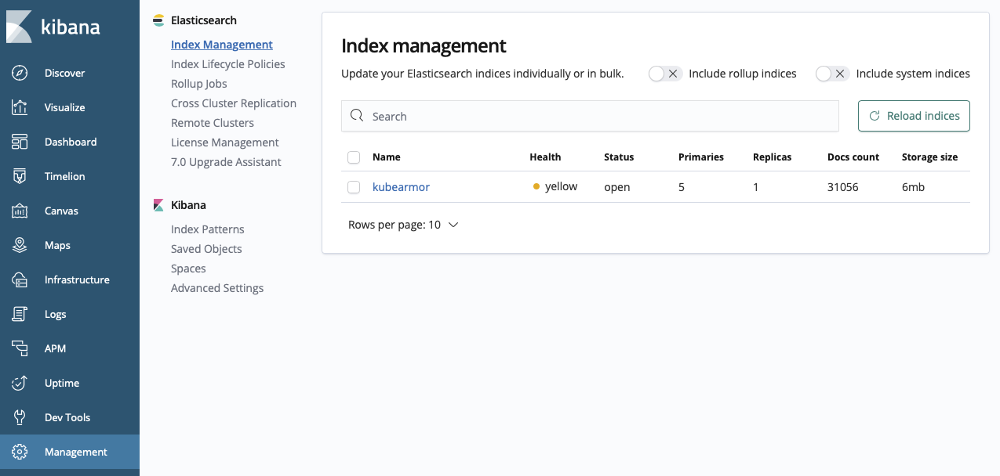
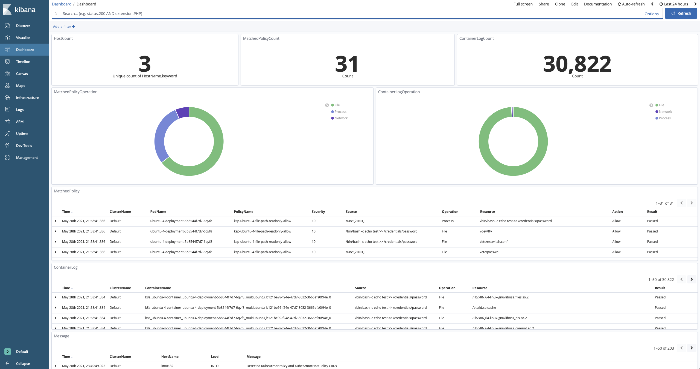

# Integration with ELK

KubeArmor provides a dashboard by integrating with Logstash + Elasticsearch + Kibana.

For this, KubeArmor, KafkaClient, and Kafka should be deployed.  
If you didn't set up KubeArmor's Kafka Client or the Kafka system, please follow the steps described in [KafkaClient](https://github.com/kubearmor/kubearmor-kafka-client).

If those are ready, you can deploy ELK now. Note that the ELK stack will be deployed in the "kubearmor" namespace.

```
$ cd kubearmor-elk-stack
~/kubearmor-elk-stack$ kubectl apply -f elasticsearch.yaml
~/kubearmor-elk-stack$ kubectl apply -f kibana.yaml
~/kubearmor-elk-stack$ kubectl apply -f logstash.yaml
```

It takes a couple of minutes. Wait for the completed deployments of those services.

# Kibana UI

Using your browser, you can access the Kibana UI.

```
http://[the IP address of one of the cluster nodes]:30561
```

If you just set up the ELK environment, wait until you see 'kubearmor-YYYYMMDD' in [Management] - [Index Management].



After you see 'kubearmor' in the Index Management, go to [Management] - [Saved Objects] and import [kibana-export.json](https://github.com/kubearmor/kubearmor-elk-stack/blob/master/kibana-export.json).

If you see the logs in [Discover], all works fine.


Now, feel free to make your own dashboard.


